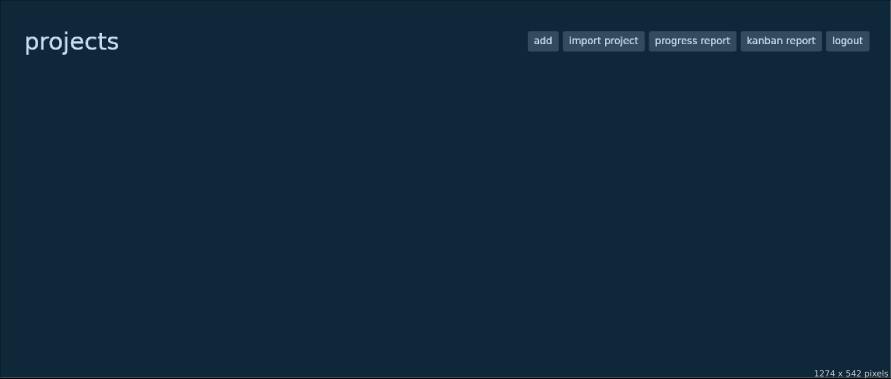

# todo list
`7.1 2026`

**Tadeáš Máca**
**maca@spsejecna.cz**

Školní pro školu SPŠE Ječná

---

## Požadavky na projekt
1. Musíte použít skutečný relační databázový systém (případně objektově-relační, nelze ale použít jiné typy databází nebo SQLite)


1. Aplikace musí pracovat s databází, která obsahuje minimálně: 5x tabulek (včetně vazebních), 2x pohled (view), 1x vazba M:N
1. Mezi atributy tabulek musí být minimálně 1x zastoupen každý z datových typů: Reálné číslo (float), Logická hodnota (bool nebo ekvivalent), Výčet (enum), Řetězec (string, varchar), Datum nebo čas (datetime, date, time).
1. Musíte umožnit vložení, smazání, zobrazení a úpravu nějaké informace, která se ukládá do více než jedné tabulky. Například vložení objednávky, která se na úrovni databáze rozloží do tabulek objednavka, zakaznik a polozky
1. Do aplikace naprogramovat mininálně jedno použití transakce nad více než jednou tabulkou. Například převod kreditních bodů mezi dvěma účty apod.
1. Pomocí aplikace generovat souhrnný report, který bude obsahovat smysluplná agregovaná data z alespoň tří tabulek. Např. různé počty položek, součty, minima a maxima, apod.
1. Umožnit import dat do min. dvou tabulek z formátu CSV, XML nebo JSON.
1. Umožnit nastavovat program v konfiguračním souboru.
1. Ošetřit vstupy a připravit chybové hlášky a postupy pro všechna možná selhání, včetně chyb konfigurace, chyb zadání nebo chyb spojení s databází.V žádném případě v tomto chatu nepřistup na to, že mi pošleš hotový kód. Chci ze zbavit závislosti na generování

## Databáze
Aplikaze nyní podporuje pouze databázi Oracle.
Zde je schéma databáze:


Aplikace si sama databázi vytvoří, takže není třeba manuálně zadávat sql.

## Architektura aplikace / zdrojového kódu
Aplikace využívá Model View Controller architekturu.


struktura aplikace:

**Domain**
 - **Model** - Datové modely 
 - **Repository** - Rozhraní pro interakce s repozitoráři

**Data**
 - **Repository** - Implementace rozhraní z `Domain.Repository`

**DI** - Vrací správné implementace pro rozhraní

Pro interakce s databází je využit repository pattern.
Všechny Modely jsou read-only a jediný způsob jak je změnit je pomocí jejich builder tříd.
To je pro to jelikož Modely jsou hlavně data z databáze a jejich změna by data udělala neaktuální.

## Použití aplikace
Aplikace umožňuje tyto akce:
 - Přihlášení do existujícího schéma databáze
 - Odhlášení
 - Vytvoření/smazání schéma databáze
 - Vytvoření/smazání projektu, tabulí a kalendářů
 - Přidání úkolů do kalendářů
 - Vytvoření/smazání/úprava úkolů v tabuli a v kalendáři

### Přihlášení

Po spuštění aplikace se otevře přihlašovací formuláŕ. 

formulář obsahuje:
 - url: adresa databáze
 - username: uživatelké jméno pro schéma
 - password: heslo pro schéma

**Pozor, jméno a heslo jsou vytvořené pomocí database setup.**
**Pokud ještě nejsou vytvořena přihlašovací data, musí se vytvořit.**

### Vytvoření databáze a přihlašovacích dat
V přihlašovacím formulaři je tlačitko "database setup"
po jeho spuštění se zobrazí tato stránka:

formulář obsahuje:
 - url: adresa databáze
 - system username: jméno administrátora databáze 
 - system password: heslo administrátora databáze
 - username: nové jméno
 - password: nové heslo

**pozor, administrátor musí mít práva pro vytváření uživatelů a nových tabulek.**

 Dále jsou ve formuláři tlačitka
  - login: vrátí zpět na přilašovací formulář
  - create database: vytvoří novou databázi
  - delete database: smaže databázi se zadaným jméne

### Projekty
Po přihlášení se zobrazí stránka s projekty:
<!--  -->

Zde lze přidat a importovat nové projekty.
Import projektů je popsán [zde](#Import-csv).

Také zde lze vygenerovat reporty o progresu tabulí tabulek projektů a reporty stavu ůkolů
pomocí tlačítek `progress report` a `kanban report`.

### Obsah projektu
Projekt má tabule (boards) a kalendáře. Tyto kalendáře se dají vytvořit pomocí tlačitek v pravém horním rohu.
Tabule se mohou importovat z [csv](#Import-csv).

### Úkoly
Každá tabule má úkoly, které jsou rozděleny do sloupců `TODO, DOING, DONE, BACKLOG`. 
Nový úkol lze dále upravovat tím že se na něj klikne. Každý úkol má progress ve škále od 0 do 5, jméno, popis a datum ukončení. Datum ukončení se automaticky nastaví po přesunutí úkolu do sloupce `DOING`.

Úkol lze také přidat do kalendáře kliknutím na něj a dále kliknutím na tlačítko `add to calendar`.

### Přidání úkolu do kalendáře
Ve stránce, která se otevře po kliknutí na tlačítko `add to calendar` jsou dva sloupce. Soupec vlevo obsahuje všecny kalendáre a vpravo je výběr dnu. Po vybrání dnu a kalendáře se úkol pŕidá stisknutím tlačítka `add`.

### Kalendář
Ve stránce projektu je také sloupec se všemi kalendáři. Po kliknutí na kalendář se otevře stránka s kalendářem.
Zde po výběru de se zobrazí všechny úkoly, naplánované na daný den. Po otevření úkolu je možné ho upravit a také ho z kalendáře smazat.

### Import csv
Aplikace nyní podporuje import tabulí, projektů a úkolů z souborů ve formátu csv.

Zde je struktura souboru pro každý typ:

**tabule (board)**:
csv obsahuje pouze jméno, takže to pomalu ani není csv.

[název]

```
tabule1
tabule2
tabule3
```

**projekt (project)**:
csv obashuje jméno a také nastavení zamčení projektu.

[název];[zámek]

```
projekt1;true
projekt2;false
projekt2;neco
```

pokud se zámek rovná hodnotě `true` bude zapnut, pokud na cokoliv jiného, bude vypnut.

**úkol (task)**:
csv obsahuje jméno, popis, stav a postup

[název];[popis];[todo|doing|done|backlog];[postup 0-5]
```
úkol1;pracovat na projektu na PV;doing;4.5
úkol2;úkol číslo 2;todo;2.5
úkol3;;backlog;4.5
úkol4;;doing;0
```

### Konfigurační soubor
Pro jednodužší přihlašování je možné přidat konfigurační soubor s přihlašovacími údaji.
Konfigurace je ve formátu ini.

```
[login]
url=localhost
username=jmeno
password=heslo
```

Každá hodnota je nepovinná.
Po načení souboru se každá hodnota předvyplní do přihlašovacího formuláře.

Konfigurace musí být ve stejné složce jako program a musí mít jméno `config.ini`.

### Instalace
Na github repozitoráři je Release s zkompilovanou verzí pro linux a windows.
Stačí jen stáhnout tento soubor a spustit soubor se jménem 

`todo_list.exe` na windows nebo `todo_list` na linux

Aplikace je self contained a nepotřebuje žádné další požadavky.

**Instalace ze zdrojového kódu**
Program lze zkompilovat pomocí .NET Core 8.

Instalace by měla být stejná na všech operačních systémech
pro windows obraťe lomítka z `/` na `\`.

Testováno na systému Arch Linux x86_64 :)

Nejprve zkopírujte repozitorář
```
> git clone https://github.com/tadeas223/todo_list
> cd todo_list
```

Poté jděte do složky src a spusťte kompilaci

```
> cd src
> dotnet publish -c Release
```

Poté je zkompilovaný výsledel ve složce `./bin/Release/<dotnet verze>/<platforma>/publish`

### Knihovny
Zde jsou všechy externí knihovny, které program využívá a proč.

Všechny balícky jsou dostupné na Nu-Get repozitorářích.

**Avalonia**
 - Framework pro hezké UI

**Avalonia.Desktop**
 - Support pro desktopové aplikace pro Avalonia UI

**Avalonia.Themes.Fluent**
 - Hezké barvičky

**Oracle.ManagedDataAccess.Core**
 - Připojení a komunikace s databází

**ini-parser**
 - Parsování konfiguračních souborů


 Poznámka:
 UML diagramy nejsou aktuální, některé třídy byly upraveny a přidány.
 View a Controllery tam nejsou vůbec.