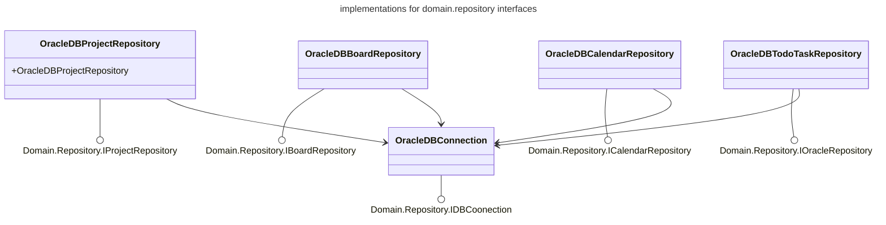

```mermaid
---
title: implementations for domain.repository interfaces
---
classDiagram
direction TB

    class OracleDBConnection

    class OracleDBProjectRepository
    class OracleDBBoardRepository
    class OracleDBCalendarRepository
    class OracleDBTodoTaskRepository
    
    OracleDBConnection --() Domain.Repository.IDBCoonection
    OracleDBProjectRepository --() Domain.Repository.IProjectRepository
    OracleDBBoardRepository --() Domain.Repository.IBoardRepository
    OracleDBCalendarRepository --() Domain.Repository.ICalendarRepository
    OracleDBTodoTaskRepository --() Domain.Repository.IOracleRepository
    
    OracleDBProjectRepository --> OracleDBConnection
    OracleDBBoardRepository --> OracleDBConnection
    OracleDBCalendarRepository --> OracleDBConnection
    OracleDBTodoTaskRepository --> OracleDBConnection

    class OracleDBProjectRepository {
        +OracleDBProjectRepository
    }

    class OracleDBBoardRepository
    class OracleDBCalendarRepository
    class OracleDBTodoTaskRepository

```