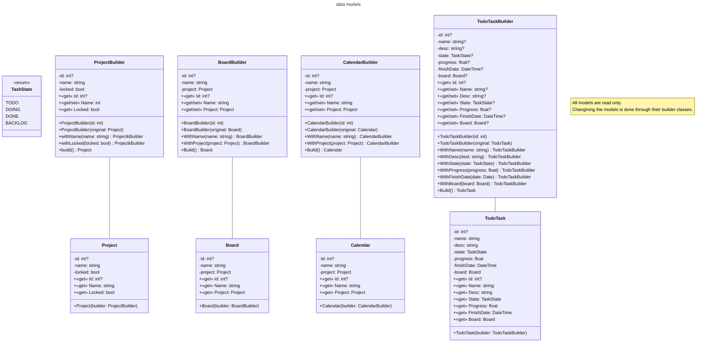

```mermaid
---
title: data models
---

classDiagram

    class TaskState
    class Project
    class Board
    class Calendar
    class TodoTask
    
    class ProjectBuilder
    class BoardBuilder
    class CalendarBuilder
    class TodoTaskBuilder

    ProjectBuilder  -- Project
    TodoTaskBuilder     -- TodoTask
    BoardBuilder    -- Board
    CalendarBuilder -- Calendar
    
    note "All models are read only. <br>Changining the models is done through their builder classes."
    

    class TaskState {
        <<enum>>
        TODO
        DOING
        DONE
        BACKLOG
    }

    class Project {
        -id: int?
        -name: string
        -locked: bool

        +«get» Id: int? 
        +«get» Name: string
        +«get» Locked: bool

        +Project(builder: ProjectBuilder)
    }

    class Board {
        -id: int?
        -name: string
        -project: Project

        +«get» Id: int?
        +«get» Name: string
        +«get» Project: Project

        +Board(builder: BoardBuilder)
    } 

    class Calendar {
        -id: int?
        -name: string
        -project: Project

        +«get» Id: int?
        +«get» Name: string
        +«get» Project: Project

        +Calendar(builder: CalendarBuilder)
    }

    class TodoTask {
        -id: int?
        -name: string
        -desc: string
        -state: TaskState
        -progress: float
        -finishDate: DateTime
        -board: Board

        +«get» Id: int? 
        +«get» Name: string
        +«get» Desc: string
        +«get» State: TaskState
        +«get» Progress: float
        +«get» FinishDate: DateTime
        +«get» Board: Board 

        +TodoTask(builder: TodoTaskBuilder)
    }

    class ProjectBuilder {
        -id: int?
        -name: string
        -locked: bool

        +«get» Id: int?
        +«get/set» Name: int
        +«get» Locked: bool
        
        +ProjectBuilder(id: int)
        +ProjectBuilder(original: Project)
        +withName(name: string) ProjectkBuilder
        +withLocked(locked: bool) ProjectkBuilder
        +build() Project
    }

    class BoardBuilder {
        -id: int?
        -name: string
        -project: Project

        +«get» Id: int?
        +«get/set» Name: string
        +«get/set» Project: Project

        +BoardBuilder(id: int)
        +BoardBuilder(original: Board)
        +WithName(name: string) BoardBuilder
        +WithProject(project: Project) BoardBuilder
        +Build() Board
    }

    class CalendarBuilder {
        -id: int?
        -name: string
        -project: Project

        +«get» Id: int?
        +«get/set» Name: string
        +«get/set» Project: Project

        +CalendarBuilder(id: int)
        +CalendarBuilder(original: Calendar)
        +WithName(name: string) CalendarBuilder
        +WithProject(project: Project) CalendarBuilder
        +Build() Calendar
    }

    class TodoTaskBuilder {
        -id: int?
        -name: string?
        -desc: string?
        -state: TaskState?
        -progress: float?
        -finishDate: DateTime?
        -board: Board?
        
        +«get» Id: int? 
        +«get/set» Name: string?
        +«get/set» Desc: string?
        +«get/set» State: TaskState?
        +«get/set» Progress: float?
        +«get/set» FinishDate: DateTime?
        +«get/set» Board: Board?

        +TodoTaskBuilder(id: int)
        +TodoTaskBuilder(original: TodoTask)
        +WithName(name: string) TodoTaskBuilder
        +WithDesc(dest: string) TodoTaskBuilder
        +WithState(state: TaskState) TodoTaskBuilder
        +WithProgress(progress: float) TodoTaskBuilder
        +WithFinishDate(date: Date) TodoTaskBuilder
        +WithBoard(board: Board) TodoTaskBuilder
        +Build() TodoTask 
    }

```