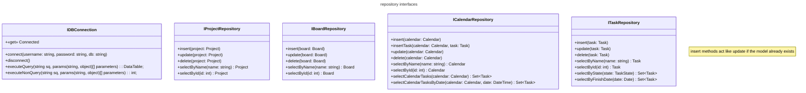

```mermaid
---
title: repository interfaces
---

classDiagram

    class IDBConnection
    class IProjectRepository
    class IBoardRepository
    class ICalendarRepository
    class ITaskRepository

    note "insert methods act like update if the model already exists"

    class IDBConnection {
        +«get» Connected
        +connect(username: string, password: string, db: string)
        +disconnect()
        +executeQuery(string sq, params (string, object)[] parameters): DataTable;
        +executeNonQuery(string sq, params (string, object)[] parameters): int;
    }

    class IProjectRepository {
        +insert(project: Project)
        +update(project: Project)
        +delete(project: Project)

        +selectByName(name: string) Project
        +selectById(id: int) Project
    }
    
    class IBoardRepository {
        +insert(board: Board)
        +update(board: Board)
        +delete(board: Board)

        +selectByName(name: string) Board
        +selectById(id: int) Board
    }
    
    class ICalendarRepository {
        +insert(calendar: Calendar)
        +insertTask(calendar: Calendar, task: Task)

        +update(calendar: Calendar)
        +delete(calendar: Calendar)

        +selectByName(name: string) Calendar
        +selectById(id: int) Calendar

        +selectCalendarTasks(calendar: Calendar) Set~Task~
        +selectCalendarTasksByDate(calendar: Calendar, date: DateTime) Set~Task~
    }
    
    class ITaskRepository {
        +insert(task: Task)
        +update(task: Task)
        +delete(task: Task)

        +selectByName(name: string) Task
        +selectById(id: int) Task
        +selectByState(state: TaskState) Set~Task~
        +selectByFinishDate(date: Date) Set~Task~
    }

```