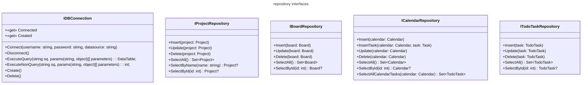

```mermaid
---
title: repository interfaces
---

classDiagram

    class IDBConnection
    class IProjectRepository
    class IBoardRepository
    class ICalendarRepository
    class ITodoTaskRepository

    class IDBConnection {
        +«get» Connected
        +«get» Created
        +Connect(username: string, password: string, datasource: string)
        +Disconnect()
        +ExecuteQuery(string sq, params (string, object)[] parameters): DataTable;
        +ExecuteNonQuery(string sq, params (string, object)[] parameters): int;
        +Create()
        +Delete()
    }

    class IProjectRepository {
        +Insert(project: Project)
        +Update(project: Project)
        +Delete(project: Project)

        +SelectAll() Set~Project~
        +SelectByName(name: string) Project?
        +SelectById(id: int) Project?
    }
    
    class IBoardRepository {
        +Insert(board: Board)
        +Update(board: Board)
        +Delete(board: Board)

        +SelectAll() Set~Board~
        +SelectById(id: int) Board?
    }
    
    class ICalendarRepository {
        +Insert(calendar: Calendar)
        +InsertTask(calendar: Calendar, task: Task)

        +Update(calendar: Calendar)
        +Delete(calendar: Calendar)

        +SelectAll() Set~Calendar~
        +SelectById(id: int) Calendar?

        +SelectAllCalendarTasks(calendar: Calendar) Set~TodoTask~
    }
    
    class ITodoTaskRepository {
        +Insert(task: TodoTask)
        +Update(task: TodoTask)
        +Delete(task: TodoTask)

        +SelectAll() Set~TodoTask~
        +SelectById(id: int) TodoTask?
    }

```