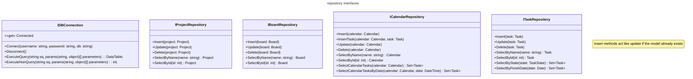

```mermaid
---
title: repository interfaces
---

classDiagram

    class IDBConnection
    class IProjectRepository
    class IBoardRepository
    class ICalendarRepository
    class ITaskRepository

    note "insert methods act like update if the model already exists"

    class IDBConnection {
        +«get» Connected
        +Connect(username: string, password: string, db: string)
        +Disconnect()
        +ExecuteQuery(string sq, params (string, object)[] parameters): DataTable;
        +ExecuteNonQuery(string sq, params (string, object)[] parameters): int;
    }

    class IProjectRepository {
        +Insert(project: Project)
        +Update(project: Project)
        +Delete(project: Project)

        +SelectByName(name: string) Project
        +SelectById(id: int) Project
    }
    
    class IBoardRepository {
        +Insert(board: Board)
        +Update(board: Board)
        +Delete(board: Board)

        +SelectByName(name: string) Board
        +SelectById(id: int) Board
    }
    
    class ICalendarRepository {
        +Insert(calendar: Calendar)
        +InsertTask(calendar: Calendar, task: Task)

        +Update(calendar: Calendar)
        +Delete(calendar: Calendar)

        +SelectByName(name: string) Calendar
        +SelectById(id: int) Calendar

        +SelectCalendarTasks(calendar: Calendar) Set~Task~
        +SelectCalendarTasksByDate(calendar: Calendar, date: DateTime) Set~Task~
    }
    
    class ITaskRepository {
        +Insert(task: Task)
        +Update(task: Task)
        +Delete(task: Task)

        +SelectByName(name: string) Task
        +SelectById(id: int) Task
        +SelectByState(state: TaskState) Set~Task~
        +SelectByFinishDate(date: Date) Set~Task~
    }

```