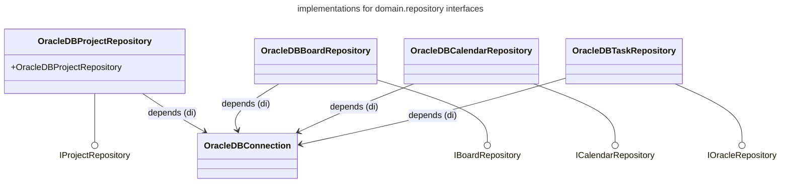

```mermaid
---
title: implementations for domain.repository interfaces
---
classDiagram
direction TB

    class OracleDBConnection

    class OracleDBProjectRepository
    class OracleDBBoardRepository
    class OracleDBCalendarRepository
    class OracleDBTaskRepository
    
    OracleDBProjectRepository --() IProjectRepository
    OracleDBBoardRepository --() IBoardRepository
    OracleDBCalendarRepository --() ICalendarRepository
    OracleDBTaskRepository --() IOracleRepository
    
    OracleDBProjectRepository --> OracleDBConnection: depends (di)
    OracleDBBoardRepository --> OracleDBConnection: depends (di)
    OracleDBCalendarRepository --> OracleDBConnection: depends (di)
    OracleDBTaskRepository --> OracleDBConnection: depends (di)

    class OracleDBProjectRepository {
        +OracleDBProjectRepository
    }

    class OracleDBBoardRepository
    class OracleDBCalendarRepository
    class OracleDBTaskRepository

```