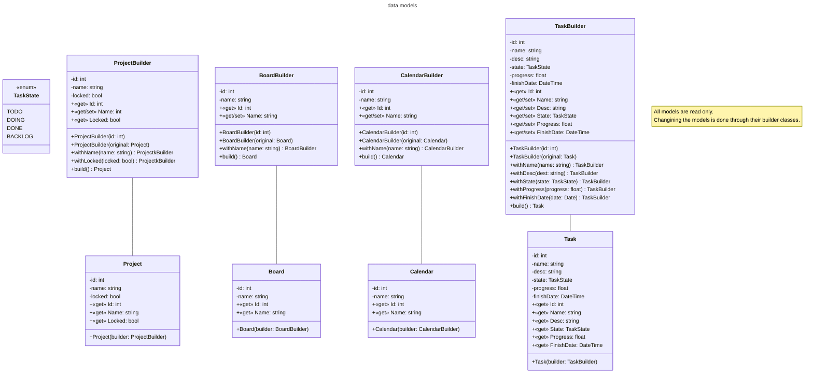

```mermaid
---
title: data models
---

classDiagram

    class TaskState
    class Project
    class Board
    class Calendar
    class Task
    
    class ProjectBuilder
    class BoardBuilder
    class CalendarBuilder
    class TaskBuilder

    ProjectBuilder -- Project
    TaskBuilder   -- Task
    BoardBuilder   -- Board
    CalendarBuilder   -- Calendar
    
    note "All models are read only. <br>Changining the models is done through their builder classes."
    

    class TaskState {
        <<enum>>
        TODO
        DOING
        DONE
        BACKLOG
    }

    class Project {
        -id: int
        -name: string
        -locked: bool

        +«get» Id: int 
        +«get» Name: string
        +«get» Locked: bool

        +Project(builder: ProjectBuilder)
    }

    class Board {
        -id: int
        -name: string

        +«get» Id: int
        +«get» Name: string

        +Board(builder: BoardBuilder)
    } 

    class Calendar {
        -id: int
        -name: string

        +«get» Id: int
        +«get» Name: string

        +Calendar(builder: CalendarBuilder)
    }

    class Task {
        -id: int
        -name: string
        -desc: string
        -state: TaskState
        -progress: float
        -finishDate: DateTime

        +«get» Id: int 
        +«get» Name: string
        +«get» Desc: string
        +«get» State: TaskState
        +«get» Progress: float
        +«get» FinishDate: DateTime

        +Task(builder: TaskBuilder)
    }

    class ProjectBuilder {
        -id: int
        -name: string
        -locked: bool

        +«get» Id: int
        +«get/set» Name: int
        +«get» Locked: bool
        
        +ProjectBuilder(id: int)
        +ProjectBuilder(original: Project)
        +withName(name: string) ProjectkBuilder
        +withLocked(locked: bool) ProjectkBuilder
        +build() Project
    }

    class BoardBuilder {
        -id: int
        -name: string

        +«get» Id: int
        +«get/set» Name: string

        +BoardBuilder(id: int)
        +BoardBuilder(original: Board)
        +withName(name: string) BoardBuilder
        +build() Board
    }

    class CalendarBuilder {
        -id: int
        -name: string

        +«get» Id: int
        +«get/set» Name: string

        +CalendarBuilder(id: int)
        +CalendarBuilder(original: Calendar)
        +withName(name: string) CalendarBuilder
        +build() Calendar
    }

    class TaskBuilder {
        -id: int
        -name: string
        -desc: string
        -state: TaskState
        -progress: float
        -finishDate: DateTime
        
        +«get» Id: int 
        +«get/set» Name: string
        +«get/set» Desc: string
        +«get/set» State: TaskState
        +«get/set» Progress: float
        +«get/set» FinishDate: DateTime

        +TaskBuilder(id: int)
        +TaskBuilder(original: Task)
        +withName(name: string) TaskBuilder
        +withDesc(dest: string) TaskBuilder
        +withState(state: TaskState) TaskBuilder
        +withProgress(progress: float) TaskBuilder
        +withFinishDate(date: Date) TaskBuilder
        +build() Task 
    }

```